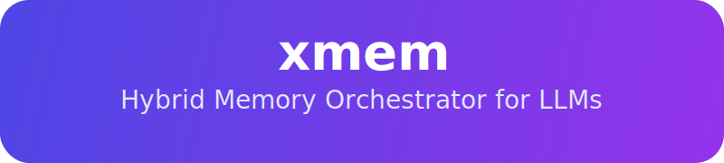

<!-- Banner -->
<p align="center">
  
</p>

<p align="center">
  <a href="https://github.com/Olserra/xmem/blob/main/LICENSE"></a>
  <a href="https://huggingface.co/spaces/Olserra/xmem"></a>
  <a href="https://github.com/Olserra/xmem"></a>
</p>

---

# xmem

Hybrid memory orchestrator for LLMs: combines long-term, session, and real-time context management for smarter, more relevant AI. Open-source, privacy-first, and easy to integrate.

---

## Quickstart

```js
const orchestrator = new xmem({
  vectorStore: chromadb,
  sessionStore: redis,
  llmProvider: mistral,
});
const response = await orchestrator.query({
  input: "Tell me about our previous discussion",
});
```

---

## Features

| Feature                | Description                                                                      |
| ---------------------- | -------------------------------------------------------------------------------- |
| Hybrid Memory          | Long-term, session, and context memory for LLMs                                  |
| Open-Source First      | Works with any open-source LLM (Llama, Mistral, etc.) and vector DB              |
| Effortless Integration | Simple API and dashboard for seamless integration and monitoring                 |
| Vector DB Support      | Qdrant, ChromaDB, Pinecone, and more                                             |
| Session Store          | Redis, MongoDB, and others                                                       |
| LLM Provider Agnostic  | Llama.cpp, Ollama, and more (OpenAI supported, but open-source preferred)        |
| Public ML Service      | [Hugging Face Spaces: Olserra/xmem](https://huggingface.co/spaces/Olserra/xmem/) |

---

## Architecture

<p align="center">
  <em>System context and container diagram (see <code>architecture.xml</code> for source)</em>
</p>

---

## Getting Started

Install dependencies:

```sh
pnpm install
# or
yarn install
# or
npm install
# or
bun install
```

Run the development server:

```sh
pnpm dev
# or
yarn dev
# or
npm run dev
# or
bun dev
```

Open [http://localhost:3000](http://localhost:3000) with your browser to see the result.

---

## Contributing

Contributions are welcome! Please open issues or pull requests. For major changes, discuss them first in an issue.

- Follow the [Contributor Covenant](https://www.contributor-covenant.org/)

### Branching & Pull Requests

- Always branch from the `develop` branch.
- Use descriptive branch names, prefixed with `feature/` for new features (e.g. `feature/new-feature-name`) or `fix/` for bug fixes (e.g. `fix/some-fix`).
- Open pull requests from your feature/fix branch **into** the `develop` branch.
- Releases are managed by the maintainer, who will merge `develop` into `main` as needed.

---

## License

xmem is licensed under the Apache License, Version 2.0. See [LICENSE](./LICENSE) for details.

The xmem name and logo are trademarks of their respective owners.

---

## Links

- [Hugging Face Space: Olserra/xmem](https://huggingface.co/spaces/Olserra/xmem/)
- [GitHub](https://github.com/Olserra/xmem)
